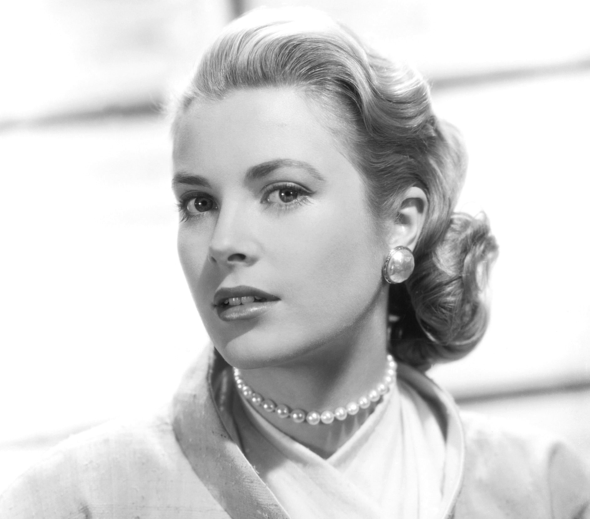
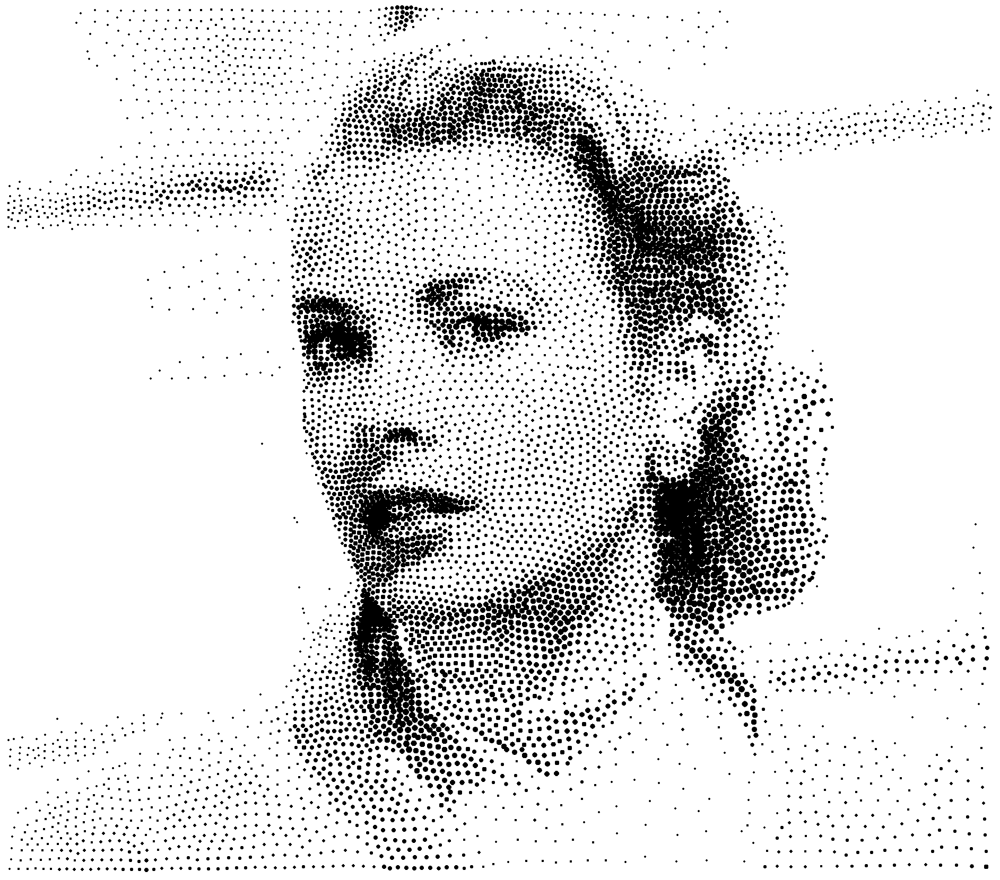

# Stipple

C++ conversion of the StippleGen Evil Mad Scientist Processing pde project.
(only the voronoi part)

<a href="https://www.evilmadscientist.com/2012/stipplegen-weighted-voronoi-stippling-and-tsp-paths-in-processing/"></a>

Original image blurred with a [CImg](https://github.com/GreycLab/CImg) filter.
Voronoi diagram computed with [jc_voronoi](https://github.com/JCash/voronoi).
Rendered in a [SFML](https://www.sfml-dev.org/index-fr.php) texture.
Texture converted to PNG with [STB](https://github.com/nothings/stb) filter.


Parameters on which you can work have effect.

```c
constexpr int MAX_PARTICLES = 8000;
constexpr float dotSizeFactor = 4; // 5;
constexpr float minDotSize = 1.75; // 2;
constexpr int cellBuffer = 100; // Scale each cell to fit in a cellBuffer-sized
                                // square window for computing the centroid.
constexpr int iterations = 1128;
```


C++ main.

```c
int
main()
{
    init("images/grace.jpg");   // Select your image here
    rt.clear(sf::Color::White);

    sprinkle();

    for (int i = 0; i < iterations; i++) {
        voronoi();
        // drawDiagram(diagram, sf::Color::Black, true, false);
        int c = centroid();
        cout << "Iteration " << i << "  -  centroids:" << c << endl;
        particles = centroids;
        jcv_diagram_free(&diagram);
    }

    drawCentroids();

    ImageUtils::saveTextureAsPNG("Stipple.png", rt);

    free();
    return 0;
}
```

Examples.

&nbsp;

&nbsp;
